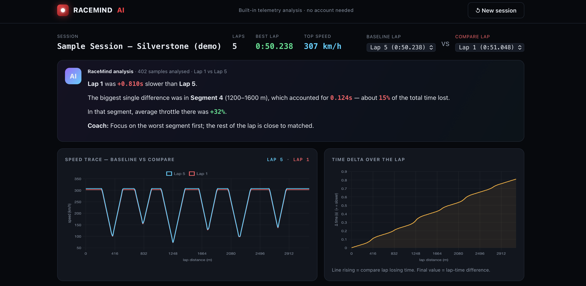

# 🏁 RaceMind AI — Telemetry Analyzer

**The AI copilot for race engineers.** Upload a telemetry export, and RaceMind finds your laps, compares them, and explains — in plain English — exactly where the lap time went.

> Instead of reading 50 overlaid graphs, you get: *"Lap 4 was 1.75s slower than your best. Most of the loss came from the corner at ~1250m, where you braked earlier and carried less minimum speed."*

**🔗 Live demo:** 
https://shahxna.github.io/racemind-ai/

---

## What it does

- **Upload any telemetry CSV** — iRacing, Assetto Corsa, MoTeC exports, or Formula Student logs. Column names are auto-detected, so different formats just work.
- **Automatic lap detection** — splits the session into laps and times each one.
- **Lap comparison** — pick any two laps and see the time delta build up across the lap.
- **Plain-English analysis** — a built-in engine works out where time was gained and lost, the braking points, throttle application and minimum corner speeds, then writes it up like a race engineer would.
- **Segment breakdown** — a table showing exactly which part of the track cost you time.
- **Lap replay** — scrub through the lap and watch the gauges (speed, RPM, gear, throttle, brake, steering) move with real data.

Everything runs **in your browser**. No server, no account, no data leaves your machine.

## Try it

1. Open the live demo above (or open `index.html` on your computer).
2. Click **"Try a sample session"** to see it work instantly, **or**
3. Drop in `sample_telemetry.csv` from this repo, **or** your own telemetry export.

## Tech

- **Vanilla JavaScript** — no build step, no framework. The whole app is one `index.html`.
- **Chart.js** for the telemetry charts.
- **Custom analysis engine**: a CSV parser with automatic column detection, lap segmentation, distance-based resampling, per-segment time-delta computation, and a rule-based natural-language generator.

The interesting part isn't the UI — it's the data work: resampling two laps of different lengths onto a common distance grid so their time deltas can be compared meter-by-meter, then attributing the loss to specific corners.

## Expected data format

A CSV with a header row. These channels are auto-detected (names are flexible):

| Channel | Example column names |
|---|---|
| Time | `time`, `timestamp`, `sessiontime` |
| Lap | `lap`, `lapnumber` |
| Distance | `lapdist`, `distance` |
| Speed | `speed`, `vcar`, `velocity` |
| RPM | `rpm`, `enginerpm` |
| Gear | `gear`, `ngear` |
| Throttle | `throttle`, `tps` |
| Brake | `brake`, `brakepos` |
| Steering | `steering`, `steerangle` |

Missing channels are handled gracefully — the app derives distance from speed and time if needed.

## Roadmap

This is **Phase 1** of a bigger vision. Planned next:

- Phase 2 — machine-learning models for tire wear, fuel, and component-health prediction; driver coaching.
- Phase 3 — live telemetry with real-time alerts.
- Phase 4 — an AI strategy engineer that recalculates pit strategy every lap.

## Run locally

No install needed — just open `index.html` in a browser.

## License

MIT — free to use and learn from.

---

_Built as a portfolio project by shosho._
